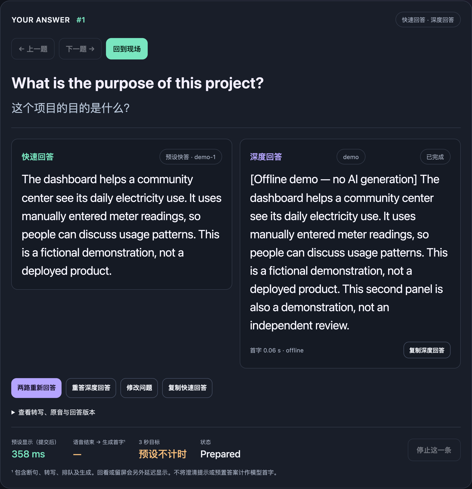

# ReplyMate · 答伴

**Prepare for meeting Q&A and English interviews with your own reference material.**

**First-text target: start displaying an answer within 3 seconds of submitting a question.**

See a quick answer first, with an independent deep answer to follow. ReplyMate supports speech input, translates questions into Chinese and lets you revisit earlier Q&A. The interface is in Chinese; answers default to English.

[Download v2.5.3](#download) · [Quick start](#quick-start) · [中文说明](../README.md) · [Release notes](https://github.com/wilbert-MD-PhD/ReplyMate/releases/tag/v2.5.3)

## Download

| Your computer | v2.5.3 installer |
| --- | --- |
| Mac with Apple silicon (M series) | [macOS Apple silicon](https://github.com/wilbert-MD-PhD/ReplyMate/releases/download/v2.5.3/ReplyMate-2.5.3-macOS-arm64.dmg) |
| Mac with an Intel processor | [macOS Intel](https://github.com/wilbert-MD-PhD/ReplyMate/releases/download/v2.5.3/ReplyMate-2.5.3-macOS-x64.dmg) |
| Windows on Intel / AMD 64-bit | [Windows installer](https://github.com/wilbert-MD-PhD/ReplyMate/releases/download/v2.5.3/ReplyMate-2.5.3-Windows-x64-Setup.exe) |

The links above download the core app; see the release page for exact sizes. AI, document parsing and local speech components download separately when you install them. The app shows each download size. [All releases and older installers](https://github.com/wilbert-MD-PhD/ReplyMate/releases).

[](images/replymate-v2.5.0-answers-3x.png)

Click the image for the original · [View the full interface](images/replymate-v2.5.0-overview-3x.png)

*Actual interface using the bundled fictional material and offline demo. The answers and timings shown are not real AI generation or performance results.*

## Quick start

1. **Install and open.** On Mac, open the DMG and drag ReplyMate into Applications. On Windows, run the installer. The app opens in your default browser; no separate Node.js installation or terminal commands are needed.
2. **Try the sample.** Click a prepared question near the bottom of the page to explore the interface offline, without signing in.
3. **Enable AI.** Click **启用 AI 回答** (Enable AI answers), then confirm the component download and installation. Once installed, click **登录 ChatGPT** and authorize on the official sign-in page. The app connects and automatically warms up the answer sessions, showing progress at the top. Warm-up uses your account quota.
4. **Import material.** Click **选择资料**, or drop a file into the import area. TXT, Markdown and reference-library JSON work immediately. Word / PowerPoint and PDF require their corresponding components.
5. **Ask a question.** Type a question and click **立即回答**, or press `Ctrl+Enter` / `Command+Enter`. For speech input, choose browser transcription or install the local speech components.

**First launch:** Installers are currently unsigned and are not Apple-notarized. Your operating system may show an unidentified-developer prompt; managed computers may block the app.

## Features and components

| Feature | What to install | Network requirement |
| --- | --- | --- |
| Demo, typed input, TXT / Markdown / JSON imports | Core app only | Works offline |
| Quick answers, independent deep answers, Chinese question translations | AI answer component | Internet, Codex access and available account quota |
| Word / PowerPoint text extraction | Word and PowerPoint component | Local parsing after installation |
| PDF text extraction | PDF text-reading component | Local parsing after installation; no OCR |
| Browser speech transcription | A supported browser and microphone permission | May use the browser vendor's cloud service |
| Local speech transcription | Whisper engine and one speech model | Works offline after installation |

The component center supports pause, resume, repair, uninstall and manual import. The recommended Turbo multilingual model is about 574 MB, with the engine installed separately. Smaller models are also available. Switching recognition languages within one multilingual model does not require another download.

- **Quick and deep answers start together.** The quick lane races two available models by default. The deep model runs independently, so a slower deep answer does not block the next question.
- **Three-second first-text target.** The target is the first quick-answer character within three seconds of submission. Actual latency is shown per question. The current release's real-account success rate is still unverified; demo and prepared answers do not count as AI results. [Measurement scope and historical results](latency-benchmark.md).
- **Multilingual input.** Select a speech recognition language separately from the answer language, which currently defaults to English. Multilingual speech models use your selected language; English-only models support English only. Recognition quality still needs validation for each language.
- **History and retries.** Revisit questions from the current session, edit and retry a question, retry only the deep answer, or use prepared answers you have checked.

## Accounts and privacy

AI features require Codex access and available quota on your account. Model races, deep answers, Chinese translations and automatic warm-up all use that quota. Offline demos do not. Model access depends on actual inference permissions.

The installed official Codex component handles authentication. Sign in on the official authorization page; you do not enter passwords or paste tokens into ReplyMate. References, backups and account state are stored in the app's own local data directory.

- Documents are parsed locally. In local Whisper mode, audio stays on your computer, with no automatic fallback to online recognition.
- Browser speech recognition may send audio to the browser vendor.
- **When AI answers are enabled, questions, recent questions, transcription alternatives, reference summaries and relevant excerpts are sent to the model service.** This also applies when transcription is local. The model service's retention rules apply.
- The interface server listens only on the local loopback address. Current Q&A and recordings stay in page memory and disappear when the page closes or reloads.

## Frequently asked questions

**Can it read scanned PDFs, images or charts?**

Only readable text is extracted. OCR, chart interpretation and formula interpretation are not included. Convert or supplement these materials as text first. A failed text import leaves your current library intact.

**Can I import several documents? What happens when I replace material?**

Select or drop multiple files with no application-imposed file count or size limit. Append to the current library (default), or replace it. The whole batch is validated before saving and backing up the previous library; any failure preserves the existing library. Successful imports clear the current page's Q&A, so copy answers you need first. The first import excludes demo material; appending preserves existing prepared answers. See [formats, limits and prepared answers](library-format.md).

**Can a Chinese question retrieve English reference excerpts?**

Input supports Chinese and other non-Latin scripts, but excerpt retrieval uses same-language lexical matching, not cross-language semantic search. The reference summary is still sent to AI. Use the same language for questions and key reference excerpts where possible, and check the answer's supporting material.

**What if a model is unavailable after sign-in?**

With only one quick model available, the app shows single-model mode. If the default deep model is unavailable, select an available model in model settings. A model appearing in the catalog does not guarantee inference access; permissions and quota depend on actual requests.

**Can I use it without speech recognition?**

Typing is always available. Browser recognition depends on your browser and device; try Chrome or Edge. For local recognition, install the engine and a model, apply the model and language in **组件与本地语音**, and wait for the ready status before recording. Press `Esc` to pause.

**Does closing the tab quit the app or delete my material?**

Closing the browser tab leaves the app running. Use **退出答伴** at the bottom of the page or the tray/menu-bar menu to quit. Closing the page clears session Q&A and recordings, while imported material and login state remain. Signing out does not delete reference material.

## Development and further reading

Source use requires Node.js 22.13 or newer. In the source directory, run:

```sh
npm ci --ignore-scripts
npm start
```

Open [http://127.0.0.1:8780](http://127.0.0.1:8780) for the offline demo. See [development notes](development.md) and [component development](components.md) for source AI configuration, model policy, testing and packaging. The source branch may include changes not yet shipped in installers; see the [source changelog](CHANGELOG.md).

[Release notes](release-v2.5.0.md) · [Validation scope](validation.md) · [Report an issue](https://github.com/wilbert-MD-PhD/ReplyMate/issues)

[MIT licensed](../LICENSE). Bundled and separately installed components retain their own licenses; see [third-party notices](THIRD_PARTY_NOTICES.md).
